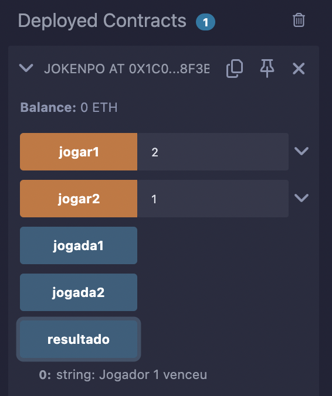

## Smart Contract Jokenpo Solidity

&ensp; Neste repositório, tem um codigo sobre o jogo jokenpo, também tem testes manuais do funcionamento do contrato em si. Ele foi realizado em solidity na plataforma do IDE REMIX

### Regras
- Pedra vence Tesoura
- Tesoura vence Papel
- Papel vence Pedra
- Jogadas iguais = Empate

### Como jogar
1. O dono define os dois jogadores 
2. Jogadores usam `1`, `2` ou `3` cada um sendo:
   - 1 = Pedra
   - 2 = Papel
   - 3 = Tesoura
3. Resultado pode ser visto com `resultado`

### Prints

&ensp; abaixo tem a vitoria do jogador 1 que venceu utilizando pedra (1) enquanto o jogador 2 utilizou papel (2):

  Figura 1 - vitoria do jogador 1 
   
  Fonte: Material produzido pelo autor (2025).

&ensp;Aqui abaixo tem um empate quando ambos os jogadores fazem jogadas iguais

  Figura 2 - empate dos jogadores 
   
  Fonte: Material produzido pelo autor (2025).

### Compilador
- Solidity versão `0.8.19`

ps: No codigo eu consegui apenas criar a logica do jogo em si e fazer com que ele crie um resultado, nao ficou muito complexo, mas foi o jeito que eu consegui compilar e fazer funcionar, sei que nao foi muito mas tenta considerar o meu esforço